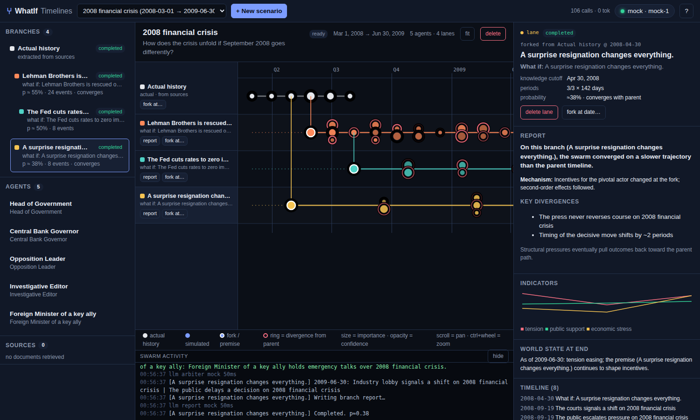

# ⑂ WhatIf Timelines

Counterfactual forecasting with an LLM **agent swarm**, on a timeline GUI where alternate histories fork off a
baseline like branches in a git graph. MiroFish-inspired (retrieve → cast personas → simulate → report), built to run
in **Google Colab** on `localhost`, with **any OpenAI-compatible model** — an OpenAI key or a free tier
(Cerebras, Groq, Gemini, OpenRouter) or local Ollama.



## What it does

1. **Retrieve, date-cut.** For your topic the server pulls
   * English Wikipedia article **revisions as they existed on the cutoff date** (MediaWiki revision history) — so
     agents can't peek at the ending;
   * **GDELT** news headlines in the 120 days before the cutoff (2017 onward);
   * the **present-day** article text (used *only* to extract the actual-history baseline);
   * any **seed documents** you paste.
2. **Ground.** A leakage-filter pass rewrites the material into a briefing containing only what was knowable on the
   cutoff date, and lists what it stripped (visible in the GUI, so you can judge leakage risk yourself).
3. **Cast, then research.** The model designs the 2–12 actors whose decisions drive the situation — real named
   people, their counterparties and kingmakers. Then a research agent builds an **evidence-backed dossier per actor**
   as of the cutoff: Wikipedia + Wikiquote revisions as-of, web search (Exa date-cut / Serper / DuckDuckGo) with pages
   fetched from the **Wayback Machine snapshot before the cutoff**, dated evidence extraction, and a synthesis in the
   schema the IC uses for at-a-distance leader profiling — precedents, Operational Code (George/Walker), Leadership
   Trait Analysis (Hermann), decision style, on-record commitments, pressure points, relationships, a quote bank — each
   cited, with a confidence, a gaps list and a leakage/unsupported-claims critic pass. The dossier digest rides in every
   agent prompt. (Rationale: Park et al. 2024 — agents built from rich first-person material replicate real people's
   behaviour at ~85% normalized accuracy; agents built from short persona paragraphs do markedly worse.)
4. **Baseline.** A dense real timeline between your anchor date and today is extracted onto the grey *Actual history*
   lane — from the topic and event articles plus Wikipedia **year articles** ("2003 in the United States"), in ≤2-year
   windows, all domains — so the causal map has the whole world to classify, not just the topic. If the horizon is in
   the future, a *Baseline forecast* lane starts automatically from today.
5. **Fork.** Click any event → *What if…* → new lane. Before the first round the engine builds a **causal map**: every
   real event after the fork on the parent lane is classified *independent* (still happens unless a named actor
   intercepts it), *dependent* (falls away with the premise) or *contingent* (probability p), plus a **structural
   calendar** — elections, term limits, scheduled events, actor lifecycles — knowable at the cutoff. Then every period
   all agents decide **concurrently**, and an **arbiter / world model** (blind to the analyst's question) adjudicates:
   it must resolve the exogenous and structural events due that period, state **junctures** with explicit
   probabilities and both outcomes — **the engine rolls seeded dice**, the model does not get to choose — bring in
   **new actors** and retire departing ones, score **divergence** from the parent lane, and update indicators and
   memories. Periods are **adaptive** — days right after the fork, doubling to months, then uniform — so consequences
   unfold at the right grain. Every actor carries a **psychological state** (office, capital, credibility, pressure,
   priorities, grievances) that the arbiter updates and that drives prospect-theory behaviour (losing → risk-seeking,
   winning → consolidation, commitments stick, grievances seek payback). Persistent **world variables** (economy,
   approval, legislature control, war footing, media climate) feed elections and succession. **Recurring hazards** are
   tracked: every juncture carries a base-rate note and a hazard id; the engine refuses silent probability creep and
   damps a hazard after repeated hits. Fork ×N for a **Monte Carlo** group: runs differ by seed and an aggregate codes
   the outcome question across them. **Score vs. actual history** gives a Brier score on junctures with known real
   outcomes and an event hit-rate, plus the run's systematic biases. Branches can be forked from branches.
   Between the arbiter's draft and the commit, a **plausibility critic** (strong model) checks every period for leakage
   and anachronism, capability violations, repetition, miscalibrated junctures and missing consequences, and applies
   surgical fixes (drop / rewrite / adjust p / add) that are logged on the lane. Agents also have a **private channel**:
   up to two messages per period to other actors (offers, threats, warnings), delivered next period and visible to the
   arbiter — coalitions and deals can form off-stage.
6. **Plan interventions (time-traveller mode).** On any lane: give a target outcome and a deadline; the planner proposes
   K minimal, dated interventions with causal chains, runs each as a Monte-Carlo group to the deadline, scores them
   against the target and writes a decision memo ranking them by success rate, footprint and prior plausibility.
7. **Analyse.** Each finished lane gets a report: narrative, mechanism, probability estimate, key divergences,
   signposts, the assumptions it rests on, whether it converges back to the parent. **Interview** any agent inside any
   lane; **compare** two lanes.
8. **Steer.** You usually know the actors better than the model does. Every persona is **editable** (track record,
   playbook, relationships, red lines), you can **add** actors or **recast** with guidance, and **analyst notes** on the
   scenario or on a single fork are injected into every agent and arbiter prompt as expert priors. Set a **strong
   model** (e.g. `gpt-4.1`) for the judgement roles — casting, arbiter, reports, history extraction — while agents run
   on a cheap one.

## Run in Colab

Open `notebooks/WhatIf_Timelines_Colab.ipynb` in Colab, *Runtime → Run all*, follow the printed link.
Keys are read from Colab Secrets (`OPENAI_API_KEY`, `CEREBRAS_API_KEY`, `GROQ_API_KEY`, `GEMINI_API_KEY`,
`OPENROUTER_API_KEY`) or pasted in the notebook or in the GUI's provider dialog.

## Run locally

```bash
pip install -r requirements.txt          # or: pip install -e .
cp .env.example .env                      # set WHATIF_PROVIDER + LLM_API_KEY
python -m whatif --port 8000              # → http://localhost:8000
# or, no key at all, to click around:
python -m whatif --provider mock
```

Env vars use the same names as go-mirofish (`LLM_API_KEY`, `LLM_BASE_URL`, `LLM_MODEL_NAME`) plus
`WHATIF_PROVIDER` for a preset, `WHATIF_STRONG_MODEL` for the judgement-role model, `WHATIF_RESEARCH_DEPTH`
(off|quick|standard|deep) and optional `EXA_API_KEY` / `SERPER_API_KEY` for date-cut web search in dossiers. Everything can also be changed at runtime from the provider chip in the top bar.

| preset | base URL | default model | cost |
|---|---|---|---|
| `openai` | api.openai.com | gpt-4o-mini | paid (≈ $0.05–0.10 per branch with 4o-mini) |
| `cerebras` | api.cerebras.ai | llama-3.3-70b | free tier — best free choice |
| `groq` | api.groq.com/openai | llama-3.3-70b-versatile | free tier (low tokens/min → slower) |
| `gemini` | generativelanguage.googleapis.com/…/openai | gemini-2.5-flash | free tier (low requests/day) |
| `openrouter` | openrouter.ai/api | any `…:free` model | free models, low daily cap |
| `ollama` | localhost:11434 | llama3.1 | local |
| `mock` | — | — | offline canned agents |

Any other OpenAI-compatible endpoint: set `LLM_BASE_URL`, `LLM_API_KEY`, `LLM_MODEL_NAME`.

**Cost model.** One branch = `rounds × (agents + 1) + 3` LLM calls (default cap 12 rounds, 6 agents → ~90 calls).
Knobs: max rounds (per fork or globally), agents per scenario, `WHATIF_CONCURRENCY`, `WHATIF_RPM`,
`WHATIF_BRIEF_CHARS`. Free-tier presets default to concurrency 3 and a shorter briefing.

## API

| | |
|---|---|
| `POST /api/scenarios` | `{title, question, anchor_date, horizon_date, step_days, n_agents, wiki_titles?, user_docs?}` |
| `GET /api/scenarios/{id}` | full state: personas, docs, branches, events, reports, log |
| `POST /api/scenarios/{id}/fork` | `{parent_branch_id, fork_event_id?, fork_date?, premise, name?, max_rounds?, step_days?, notes?, runs?, seed?}` |
| `GET …/aggregate?group=` | Monte-Carlo aggregate for a run group |
| `POST …/plan` `{parent_branch_id, target, deadline, start?, k?, runs?, rounds?, notes?}` | intervention search (results in scenario `plans`) |
| `POST …/branches/{bid}/calibrate` | Brier score of a run's junctures vs. actual history |
| `POST …/branches/{bid}/stop`, `DELETE …/branches/{bid}` | |
| `PATCH …/personas/{pid}` (or `/personas/new`), `DELETE …/personas/{pid}`, `POST …/recast` `{notes}` | edit the cast |
| `POST …/research` `{persona_ids?, depth?}` | build dossiers (all missing, or the given actors) |
| `POST …/branches/{bid}/interview` | `{persona_id, question}` |
| `GET …/compare?a=&b=` | LLM comparison of two lanes |
| `GET /api/events` | SSE stream (log lines, agent actions, LLM calls, progress) |
| `GET/POST /api/config`, `GET /api/models`, `GET /api/ping` | provider management |

Scenarios persist as JSON in `data/scenarios/`.

## Layout

```
whatif/
  config.py     provider presets + settings (env-driven)
  llm.py        OpenAI-compatible async client: concurrency, RPM limiter, retries, JSON repair, mock provider
  retrieval.py  Wikipedia as-of-date revisions, present-day extracts, GDELT, wikitext cleaning
  research.py   per-actor dossiers: plan → collect (Wikipedia/Wikiquote as-of, Exa/Serper/DDG, Wayback) → evidence → synthesis → critic
  prompts.py    all prompt templates (librarian, leakage filter, historian, casting, agent, arbiter, report…)
  engine.py     orchestration: prepare scenario, fork, swarm round loop, reports, interviews, comparisons
  models.py     Scenario / Branch / Event / Persona dataclasses
  store.py      JSON persistence
  server.py     FastAPI app, SSE, static GUI, Colab runner
  static/       index.html, app.css, app.js — the timeline GUI (no build step)
notebooks/      Colab notebook (+ generator script)
tests/          smoke test (REST, mock provider) and a headless UI screenshot script
```

## Relationship to MiroFish / go-mirofish

go-mirofish's Go "native" simulation worker is a placeholder — its round loop emits `"twitter round N agent K"`
strings and interviews return `"Agent responds to …"`; only graph-building and reports call an LLM — and it
requires Docker plus a Zep Cloud key. This project keeps MiroFish's idea (seed documents → knowledge → personas →
swarm → report → interview) in ~1,500 lines of Python with no external services, and adds what the counterfactual
use-case needs: date-cut retrieval, an actual-history baseline, forkable branches with divergence scoring, and the
timeline GUI.

## Honest caveats

* Forecasts are model output, not evidence. Treat probabilities as the swarm's *opinion*.
* For topics before ~2002 there is no pre-event Wikipedia revision; the leakage filter is doing the work. Check the
  "stripped" notes in each lane's briefing.
* Free tiers rate-limit hard; the client backs off and honours `Retry-After`, so a branch may simply take longer.
  A retry-after longer than 3 minutes (a daily cap) fails the branch immediately with the provider's message.
* **OpenAI accounts without billing** are capped at ~200 requests/day for gpt-4o-mini — one branch. Adding $5 of
  credit (Tier 1) lifts that to 10,000/day. Check <https://platform.openai.com/settings/organization/limits>.
* GDELT is rate-limited per IP; from shared cloud egress (Colab) it is usually unavailable and is skipped.

## Publish to GitHub (first time)

From `~/project/whatif-timelines` in a terminal on your machine:

```powershell
gh repo create whatif-timelines --private --source=. --remote=origin --push
```

or without the GitHub CLI: create an empty repo named `whatif-timelines` on github.com, then

```powershell
git init -b main
git add .
git commit -m "WhatIf Timelines v0.1"
git remote add origin https://github.com/dwtrott/whatif-timelines.git
git push -u origin main
```

The Colab notebook clones `https://github.com/dwtrott/whatif-timelines.git` by default (a private repo needs the
`https://<user>:<token>@github.com/...` form or a public repo).
